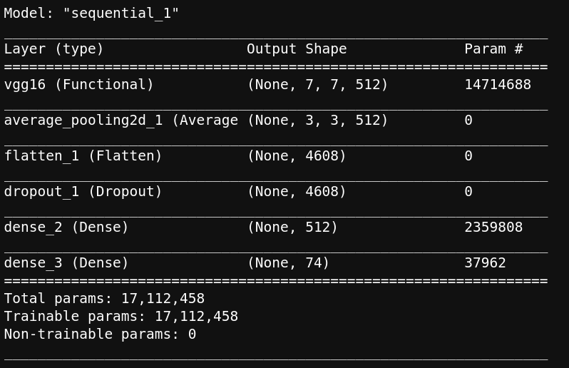
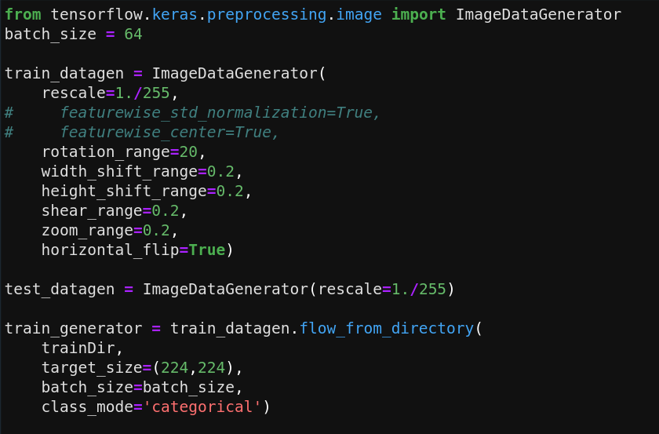
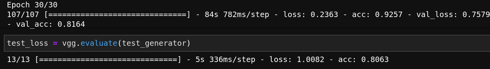
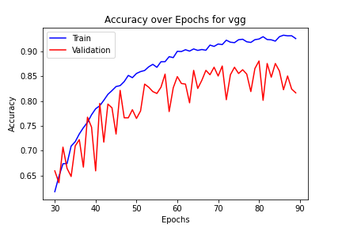

# Super Car Classification model

## Dependancies

Python: Python 3.6.9
Tensorflow: 2.4.1
PIL:
numpy: 1.19.5
Keras:
Google image download: 2.8.0

## Gather data

Using the 'google images download' package, the first 100 images of any input string are downloaded locally to my computer. The code reads a file where each line contains a supercar model for google to search, then calls the function shown to the left to download each model. The function download_images only downloads models that have not been downloaded and will remove any files that do not end in jpg. Although the format is set to jpg, a few non-jpg files often slip though so this part is necessary. 

## Organize data

Initially the images maintain their names from whatever website they are stored on. First, the images are given a number in the same manner that the Stanford car dataset is. Then each class is split into train, validation and test folders in a ratio of 80%, 10%, and 10% respectfully. In total, there are over 8,000 images split over 74 classes.

## Create model

### VGG-16
Due to the relatively small amount of input images, a complex network like Densenet or even Resnet would overfit the data, so VGG-16 is used. With over 17 million trainable parameters, VGG-16 is still too complex for the mere 7,000 training images, but there are some tricks I was able to use to reduce overfitting. 

### Data Augmentation
The Keras ImageDataGenerator was used to load input images in batches instead of as one giant numpy array or tensor. In addition, ImageDataGenerator (IDG) will distort the images by rotating, zooming, squeezing or stretching, altering the color balance and more each batch. This enables the network to be able to generalize and not overfit to the input data, basically giving the network new free images every epoch. IDG is also able to normalize the images to a mean and standard deviation of pixel values across a small sample of input images, however this was not used in the project. I expect a slight reduction in overfitting if I do end up implementing this.

### Pretraing and Transfer Learning
The idea of pretraining is to use convolution layers from VGG16 where the weights were previously trained on a massive dataset of common images. This step is important because the kernels are already almost ideal, so my dataset of only 7,000 images are able to train them with reasonable results. Transfer learning builds upon pretraining, such that only the top few, in my case 6, convolution layers out of 16 will be updated each epoch. This slightly reduces computation time. 

### Dropout
The top-most two layers were dense layers with dropout before them. A dropout of 50% was used to reduce overfitting and increase the ability of the network to generalize to new data. 

## Train and predict

### Results
The network was trained on my Nvidia GTX 1080ti and took about 2 hours and 15 minutes to complete 90 epochs. The result  was a training accuracy of 92.57%, validation accuracy of 81.64% and testing accuracy of 80.63%. Notice the validation curve of the graph to the right starts to separate from the train curve. This shows that the model is quite overfit by about 10%. There are a few things that can still be done to fix this. Cross validation can be used to tune the hyper parameters such as learning rate. The learning rate of 1E-5 was used which is very low. In addition, cross validation will take a random batch of the training data to use as validation so I wont need to sacrifice 10% of the training data. This will give me more data to play with and will reduce overfitting. 

### Analysis
In the last figure, you can see a few images. The image on the top left is the input image that the model is predicting. The graph on the right shows the top 5 predictions where an example of the first and second highest prediction, respectively, is displayed underneath. This gives you an insight on what cars the model thinks the input is or looks similar to. It is common for the model to guess other cars by the same manufacturer or similar looking cars which is to be expected.

